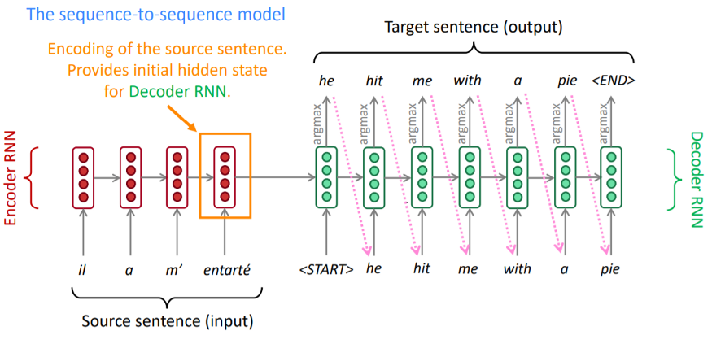
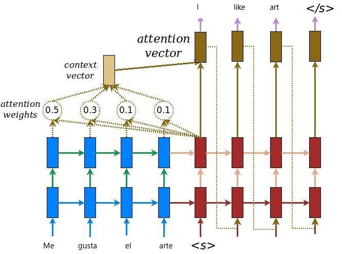
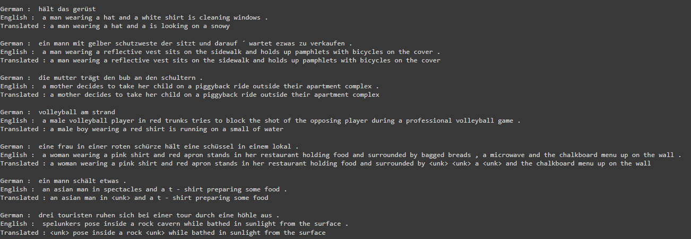

# Neural Machine Translation using Seq2Seq Model

This project implements a sequence-to-sequence (Seq2Seq) model with attention for neural machine translation (NMT). The model is trained and tested on a German to English dataset and Hindi to English.

## Dependencies

The project uses the following libraries:
- PyTorch
- TorchText
- SpaCy

## Model Architecture

The model consists of an encoder and a decoder, both of which are built using LSTM layers. An attention mechanism is incorporated to improve translation accuracy by allowing the decoder to focus on different parts of the source sentence at each step of output generation.

## Encoder

The encoder is a bidirectional LSTM that processes the source sentence and compresses it into a context vector. This context vector encapsulates information about the source sentence which the decoder uses to generate the target sentence.

## Decoder

The decoder is an LSTM that generates the target sentence from the context vector provided by the encoder. At each time step, the decoder outputs a word in the target language, taking into account the context vector and its own previous states.

## Attention Mechanism

The attention mechanism allows the decoder to focus on different parts of the source sentence at each step of the output generation. This is achieved by computing a set of attention weights, which indicate the importance of each word in the source sentence with respect to the current word being generated in the target sentence.






## Model Workflow

1. Input Sentence: The input sentence is tokenized and converted into a sequence of integer indices.
2. Encoding: The sequence of indices is passed through the encoder, producing a sequence of encoder hidden states.
3. Attention: The attention mechanism computes a context vector as a weighted sum of the encoder hidden states.
4. Decoding: The decoder uses the context vector to generate the output sentence, one word at a time.

## Training

The model is trained for around 100 epochs with a learning rate of 3e-4. The batch size is 64/16. The model parameters are saved in a checkpoint file named model_checkpoint.pth.

To continue training from a checkpoint, set load = True and make sure the checkpoint file is in the same directory as the script.

## Resuming Training

To continue training from a saved checkpoint, set load = True and ensure the checkpoint file is in the same directory as the script.

```load = True
if load:
    model.load_state_dict(torch.load('model_checkpoint.pth'))
```
## Results




## Usage

To train the model, simply run the script. The training loss will be printed at each epoch.

```# Load the trained model
model.load_state_dict(torch.load('model_checkpoint.pth'))

# Example input sentence
input_sentence = "Hallo, wie geht's?"

# Translate
translated_sentence = model.translate(input_sentence)
print("Translated Sentence:", translated_sentence)
```
## External Source Code

[Google Colab](https://colab.research.google.com/drive/1_3O8zUt97ktmifM8UlTWGK1UPKlrWZbV?usp=sharing)